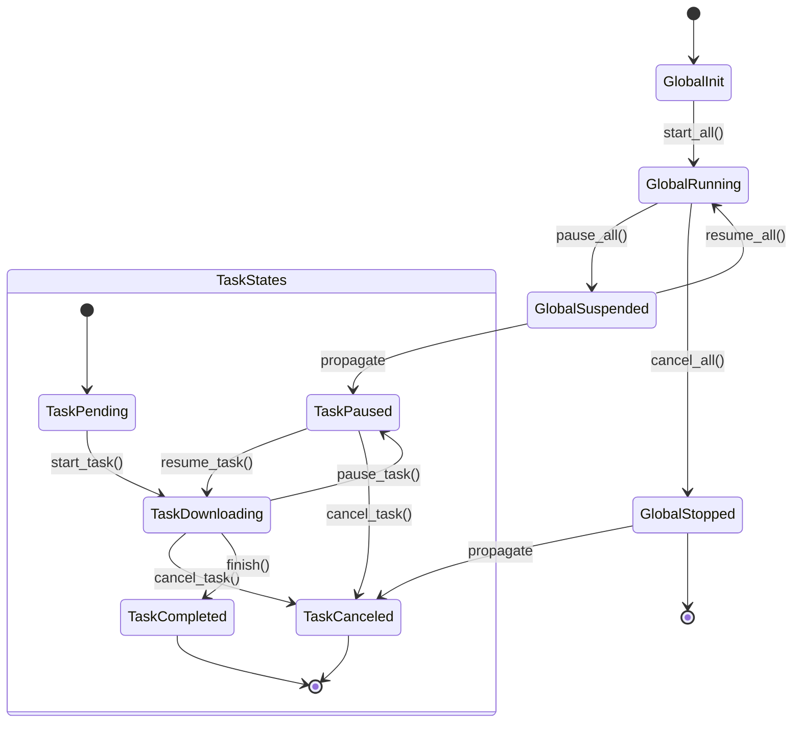

<!-- markdownlint-disable MD033 MD041 MD045 -->
<p align="center" dir="auto">
    
</p>

<p align="center">
  <h1 align="center">Vielpork 🚀</h1>
  <p align="center">A high-performance multi-threaded HTTP downloader with extensible reporting and resolution strategies.</p>
</p>

<p align="center">
  <a href="https://www.rust-lang.org/" target="_blank"></a>
  <a href="https://crates.io/crates/vielpork" target="_blank"></a>
  <a href="https://docs.rs/vielpork" target="_blank"></a>
  <a href="https://github.com/islatri/vielpork" target="_blank"></a>

</p>

<p align="center">
  <hr />

[中文版本](README.md) | [English Version](README_EN.md)

**Vielpork** is a Rust-powered HTTP downloader designed for performance and extensibility. It offers:

- 🚀 Multi-threaded downloading for maximum speed
- 📊 Flexible reporting system with multiple built-in options
- 🔧 Customizable resolution strategies for different network scenarios
- ⏯️ Pause/resume functionality with checkpoint support

# Documentation

1. English: [https://hakochest.github.io/vielpork-en/](https://hakochest.github.io/vielpork-en/)
2. 中文: [https://hakochest.github.io/vielpork-cn/](https://hakochest.github.io/vielpork-cn/)



# Related Projects

- [osynic_downloader](https://github.com/osynicite/osynic_downloader): A osu beatmapsets downloader lib & TUI application based on vielpork.


## Features

### Core Capabilities

- **Multi-threaded Architecture**: Leverage Rust's async runtime for concurrent chunk downloads
- **Extensible Reporting**:
  - Built-in reporters: TUI progress bar, CLI broadcast to mpsc channel
  - Custom reporter implementation via Reporter trait
- **Smart Resolution**:
  - Custom resolution logic through Resolver trait
- **Recovery & Resilience**:
  - Resume interrupted downloads
- **Progress Tracking**:
  - Real-time speed calculations
  - ETA estimation
  - Detailed transfer statistics

## Installation

Add to your `Cargo.toml`:

```toml
[dependencies]
vielpork = "0.1.0"
```

## Quick Start

```rust
use vielpork::downloader::Downloader;
use vielpork::reporters::tui::TuiReporter;
use vielpork::resolvers::url::UrlResolver;
use vielpork::base::structs::DownloadOptions;
use vielpork::base::enums::DownloadResource;
use vielpork::error::Result;

use std::sync::Arc;
use tokio::sync::Mutex;

#[tokio::main]
async fn main() -> Result<()> {
    let options: DownloadOptions = DownloadOptions::default()
        .with_save_path("fetch".to_string())
        .with_concurrency(3);

    let downloader = Downloader::new(options, Box::new(UrlResolver::new()), Box::new(TuiReporter::new()));

    let resources = vec![
        DownloadResource::Url("https://example.com".to_string()),
        DownloadResource::Url("https://example.com".to_string()),
        DownloadResource::Url("https://example.com".to_string()),
        DownloadResource::Url("https://example.com".to_string()),
        DownloadResource::Url("https://example.com".to_string()),
        DownloadResource::Url("https://example.com".to_string()),
        DownloadResource::Url("https://example.com".to_string()),
        DownloadResource::Url("https://example.com".to_string()),
        DownloadResource::Url("https://example.com".to_string()),
    ];

    downloader.start(resources).await?;

    loop {
        tokio::time::sleep(std::time::Duration::from_secs(1)).await;
        // Because of the async nature of the downloader, we need to keep the main thread alive
    }

    Ok(())
}
```

## Built-in Options

### Reporters

- **TuiReporter**: A terminal-based progress bar based on the `indicatif` library
- **CliReporterBoardcastMpsc**: A reporter that broadcasts progress updates to multiple channels and finalizes them with a single channel ( Usage Example: In Tonic gRPC server streaming, the rx type can only be mpsc, so we need to broadcast the progress to a mpsc channel, then send it to the client through the server)

### Resolvers

- **UrlResolver**: A resolver that downloads resources from a URL, just a simple wrapper around reqwest

## Custom Components

You can see all traits at `vielpork::base::traits` and implement your own components.

### Custom Reporter

- Here are 2 traits that you need to implement with async_trait:
  - `ProgressReporter`: A trait that allows the reporter to handle progress updates
  - `ResultReporter`: A trait that allows the reporter to handle the results of operations or tasks

### Custom Resolver

- Here is only 1 trait that you need to implement with async_trait:
  - `ResourceResolver`: A trait that allows the resolver to download resources from a specific source

## 🤝 Contributing

This library was written in about a morning, so there are definitely many areas that need improvement. At present, it only meets the requirements of my own project and cannot guarantee that it will fully meet everyone's requirements.

And I am a Rust beginner, so there may be many non-standard places in the code. Because of the limited time for learning and programming, I apologize for any inconvenience caused ( >﹏<。).

So, if there are any problems with the code, or if you have any suggestions, please feel free to submit a PR or Issue, and I will handle it as soon as possible~

If you want to contribute code, please follow these rules:

- Follow the official Rust coding style
- Include test cases for new features
- Run `cargo fmt` and `cargo clippy` before submitting

## 📜 License

This project is open-source under the [MIT License](LICENSE). Please respect the original author's copyright.

## Afterword (or the prologue)

I found the word "viel" and then thought about "rufen", "ekstase", "reichen".

But when I was still hesitating, a good friend came to my dorm and brought me a cup of smoked pork shreds.

So I named it "vielpork", which means a lot of pork shreds.

But in terms of functionality, this downloader is mainly about multi-reporting channel downloads, so it's also a lot of reporting.

"report" is very close to "vielpork", which is also good.

For me, who has been eating free porridge for a week, this name is already very good.

Oh, by the way, spicy boiled pork slices can also be called VielPork. I love it.
