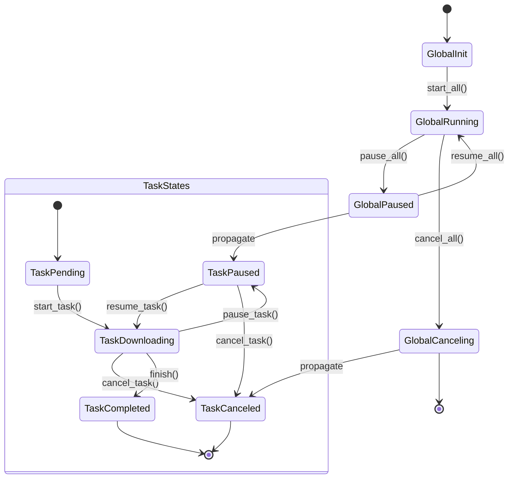

# Introduction

最开始找到了viel这个词，后面想了下rufen、ekstase、reichen

但是正在我还在犹豫不决的时候，好朋友来寝室送了我一纸杯的熏猪肉丝

所以我就直接取名叫做vielpork了，这个名字的意思是很多猪肉丝

但如果是功能描述的话，这个下载器主打的是多报道通道下载，所以也是很多报道

report的vielpork很接近，也还不错

对于连续吃了一个星期免费粥的我来说，这个名字已经很好了

